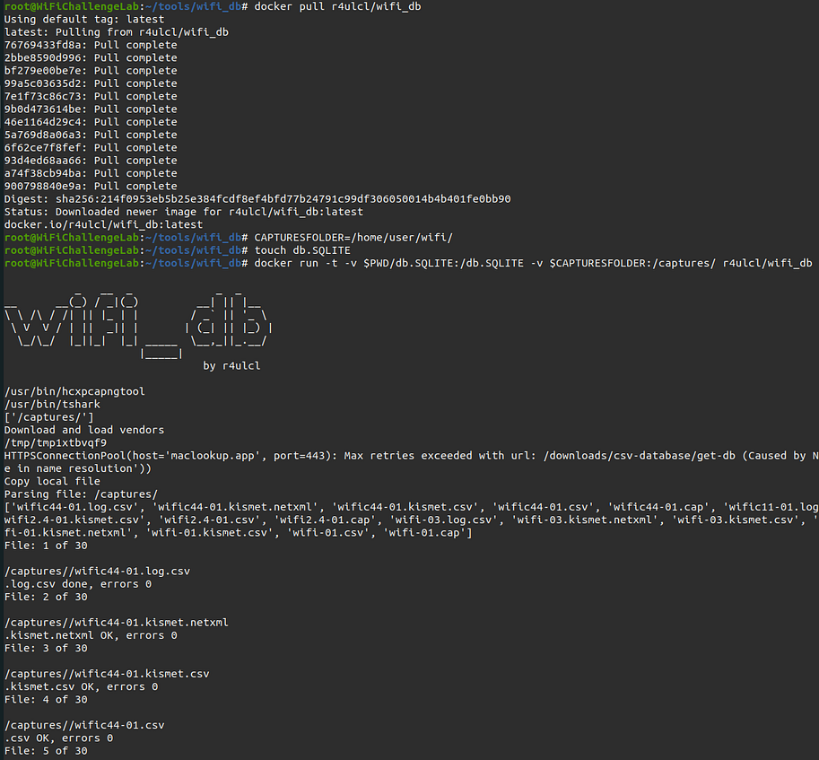
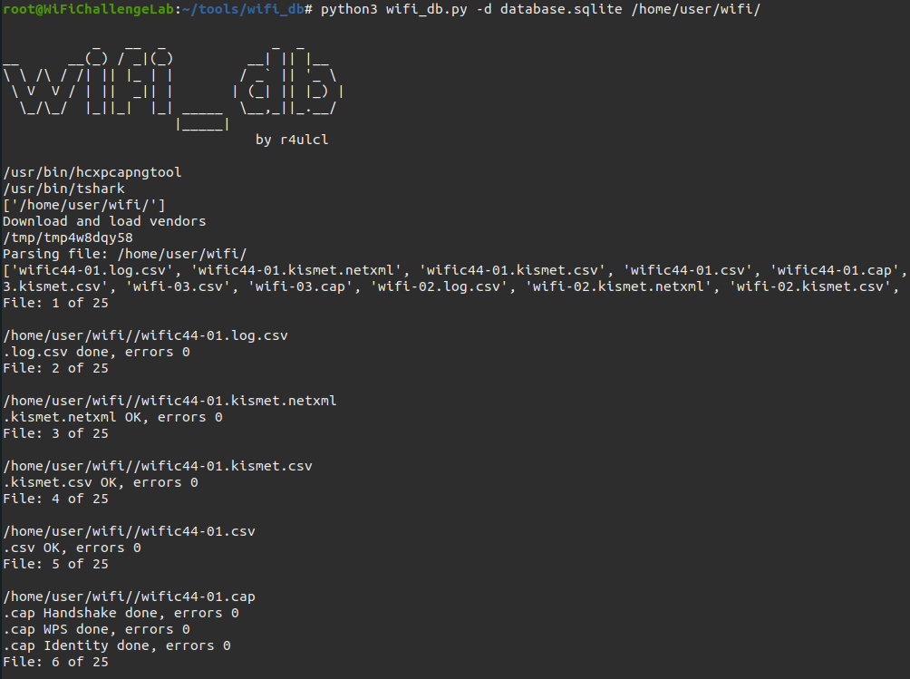
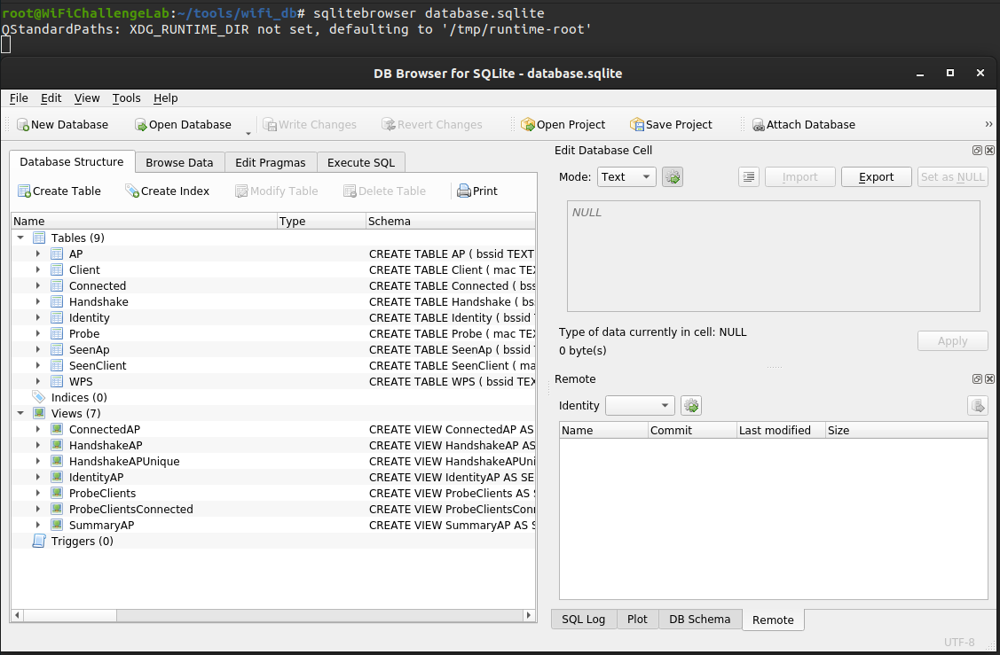
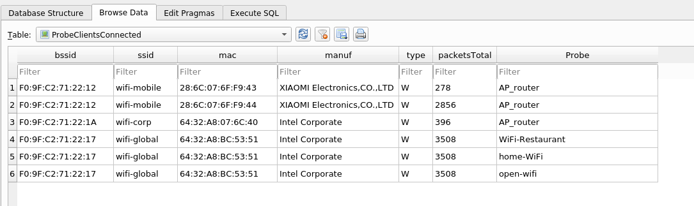

<p align="center">
  
</p>

<p align="center">
  <a href="https://github.com/r4ulcl/wifi_db/releases"></a>
  <a href="https://github.com/r4ulcl/wifi_db/blob/main/LICENSE"></a>
  <a href="https://github.com/r4ulcl/wifi_db/commits/master"></a>
  <a href="https://github.com/r4ulcl/wifi_db/commits/dev"></a>
  <a href="https://github.com/r4ulcl/wifi_db"></a>
</p>

<p align="center">
  <a href="https://github.com/r4ulcl/wifi_db/actions/workflows/docker-image.yml"></a>
  <a href="https://github.com/r4ulcl/wifi_db/actions/workflows/docker-image-dev.yml"></a>
  <a href="https://www.codefactor.io/repository/github/r4ulcl/wifi_db"></a>
  <a href="https://github.com/r4ulcl/wifi_db"></a>
  <a href="https://hub.docker.com/r/r4ulcl/wifi_db/tags"></a>
</p>

<p align="center">
  <a href="https://github.com/r4ulcl/wifi_db/stargazers"></a>
  <a href="https://github.com/r4ulcl/wifi_db/network/members"></a>
  <a href="https://github.com/r4ulcl/wifi_db/issues"></a>
  <a href="https://github.com/r4ulcl/wifi_db/graphs/contributors"></a>
  <a href="https://hub.docker.com/r/r4ulcl/wifi_db"></a>
</p>

# wifi_db

Script to parse Aircrack-ng captures into a SQLite database and extract useful information like handshakes (in 22000 hashcat format), enterprise (MGT) identities and EAP-MD5 challenge/response pairs, the X.509 certificates and RSN/WPA security configuration of each network, the 802.11r/k/v, Multiple BSSID and Channel Switch capabilities advertised by the APs, interesting relations between APs, clients and their Probes, WPS information, and a global view of all the APs seen.

## Table of Contents

- [Features](#features)
- [Install](#install)
- [Usage](#usage)
- [Database](#database)
- [Views](#views)
- [TODO](#todo)
- [License](#license)

## Features

-   Displays if a network is cloaked (hidden) even if you have the ESSID.
-   Shows a detailed table of connected clients and their respective APs.
-   Identifies client probes connected to APs, providing insight into potential security risks using Rogue APs.
-   Extracts handshakes for use with hashcat, facilitating password cracking.
-   Displays identity information from enterprise networks, including the EAP method used for authentication.
-   Extracts the X.509 certificates exchanged in enterprise (802.1X) EAP-TLS/PEAP/TTLS authentications (both AP/server and client certificates), storing all certificate fields per AP BSSID in the `Certificate` table.
-   Breaks down the RSN/WPA security of each AP (WPA version, AKM suites, pairwise/group ciphers, enterprise flag, and management-frame protection) from beacons into the `AP` table.
-   Captures EAP-MD5 challenge/response pairs for offline cracking (`hashcat -m 4800`) into the `EAPMD5` table.
-   Detects randomized (locally administered) client MAC addresses and fingerprints clients by their probe-request information elements (stored on the `Probe` table).
-   Generates a summary (`SummaryAP` view) of the APs grouped by ESSID and encryption, showing the AP and client counts, the WPA version and PMF state, and every manufacturer per group, to give a quick overview of the security status of nearby networks (and to spot SSIDs running mixed/downgraded security).
-   Records the Wi-Fi Protected Setup (WPS) configuration of each AP directly on its `AP` row.
-   Logs all instances when a client or AP has been seen with the GPS data and timestamp, enabling location-based analysis.
-   Upload files with capture folder or file. This option supports the use of wildcards (*) to select multiple files or folders.
-   Docker version in Docker Hub to avoid dependencies.
-   Obfuscated mode for demonstrations and conferences.
-   Possibility to add static GPS data.
-   Reports the Management Frame Protection (802.11w / PMF) status of each AP: the `mfpc` (capable) and `mfpr` (required) flags read bitwise from the RSN capabilities, and the derived `pmf` state (`Required`, `Capable` when it is optional, or `Disabled`), stored on the `AP` table.
-   Detects fast-roaming and management support advertised by each AP: 802.11r Fast BSS Transition (`ft_80211r`, with the `mobility_domain_id`), 802.11k Radio Resource Measurement / neighbor reports (`rrm_80211k`), and 802.11v BSS Transition Management (`bss_transition_80211v`).
-   Flags access points that advertise a Multiple BSSID set (`mbssid`, with the `max_bssid_indicator`) and that send Channel Switch Announcements (`csa`, with the `csa_new_channel` target channel).
-   Reveals cloaked (hidden) SSIDs from probe responses and (re)association requests, filling the AP name even when the beacon hides it (`ssid_revealed` marks names learned this way).


## Install

### From [DockerHub](https://hub.docker.com/r/r4ulcl/wifi_db) (RECOMMENDED)

``` bash
docker pull r4ulcl/wifi_db
``` 

### Manual installation

#### Debian based systems (Ubuntu, Kali, Parrot, etc.)

Dependencies:

- python3 
- python3-pip
- tshark
- hcxtools

``` bash
sudo apt install tshark
sudo apt install python3 python3-pip

sudo apt install pkg-config libcurl4-openssl-dev libssl-dev zlib1g-dev make gcc


git clone https://github.com/ZerBea/hcxtools.git
cd hcxtools
make 
sudo make install
cd ..
```


Installation (using a virtual environment)

``` bash
# Download repo
git clone https://github.com/r4ulcl/wifi_db
cd wifi_db

# Create and activate a venv
sudo apt update ; sudo apt install python3-venv
python3 -m venv wifi_db_env
source wifi_db_env/bin/activate

# Install dependencies
pip3 install -r requirements.txt
```

> The venv must be activated (`source wifi_db_env/bin/activate`) in every new
> shell before running `wifi_db.py`. Use `deactivate` to leave it.

#### Arch

Dependencies:

- python3 
- python3-pip
- tshark
- hcxtools


``` bash
sudo pacman -S wireshark-qt
sudo pacman -S python-pip python

git clone https://github.com/ZerBea/hcxtools.git
cd hcxtools
make 
sudo make install
cd ..
```

Installation (using a virtual environment)

``` bash
# Download repo
git clone https://github.com/r4ulcl/wifi_db
cd wifi_db

# Create and activate a venv
python3 -m venv wifi_db_env
source wifi_db_env/bin/activate

# Install dependencies
pip3 install -r requirements.txt
```

> The venv must be activated (`source wifi_db_env/bin/activate`) in every new
> shell before running `wifi_db.py`. Use `deactivate` to leave it.


## Usage

### Usage example in [WiFiChallenge Lab](https://lab.wifichallenge.com/)

- https://r4ulcl.com/posts/wifi_db-in-wifichallenge-lab/

### Scan with airodump-ng

Run airodump-ng saving the output with -w:

``` bash
sudo airodump-ng wlan0mon -w scan --manufacturer --wps --gpsd
```

### Create the SQLite database using Docker

``` bash
#Folder with captures
CAPTURESFOLDER=/home/user/wifi

# Output database
touch db.SQLITE
chmod a+rw db.SQLITE

docker run -t -v $PWD/db.SQLITE:/app/db.SQLITE -v $CAPTURESFOLDER:/captures/ r4ulcl/wifi_db
```

- `-v $PWD/db.SQLITE:/app/db.SQLITE`: To save de output in current folder db.SQLITE file
- `-v $CAPTURESFOLDER:/captures/`: To share the folder with the captures with the docker




### Create the SQLite database using manual installation

Once the capture is created, we can create the database by importing the capture. To do this, put the name of the capture without format. Remember to activate the virtual environment first (`source wifi_db_env/bin/activate`).

``` bash
python3 wifi_db.py scan-01
```

In the event that we have multiple captures we can load the folder in which they are directly. And with -d we can rename the output database.

``` bash
python3 wifi_db.py -d database.sqlite scan-folder
```




### Open database

The database can be open with:
- [sqlitebrowser](https://sqlitebrowser.org/)




Below is an example of a ProbeClientsConnected table.




### Arguments

``` bash
usage: wifi_db.py [-h] [-v] [--debug] [-o] [-t LAT] [-n LON] [--source [{aircrack-ng,kismet,wigle}]] [-d DATABASE] capture [capture ...]

positional arguments:
  capture               capture folder or file with extensions .csv, .kismet.csv, .kismet.netxml, or .log.csv. If no extension is provided, all types will
                        be added. This option supports the use of wildcards (*) to select multiple files or folders.

options:
  -h, --help            show this help message and exit
  -v, --verbose         increase output verbosity
  --debug               increase output verbosity to debug
  -o, --obfuscated      Obfuscate MAC and BSSID with AA:BB:CC:XX:XX:XX-defghi (WARNING: replace all database)
  -t LAT, --lat LAT     insert a fake lat in the new elements
  -n LON, --lon LON     insert a fake lon in the new elements
  --source [{aircrack-ng,kismet,wigle}]
                        source from capture data (default: aircrack-ng)
  -d DATABASE, --database DATABASE
                        output database, if exist append to the given database (default name: db.SQLITE)
```

### Kismet

TODO

### Wigle

TODO

## Database

wifi_db contains several tables to store information related to wireless network traffic captured by airodump-ng. The tables are as follows:


-   `AP`: This table stores information about the access points (APs) detected during the captures, including their MAC address (`bssid`), network name (`ssid`), whether the network is cloaked (`cloaked`), manufacturer (`manuf`), channel (`channel`), frequency (`frequency`), carrier (`carrier`), encryption type (`encryption`), and total packets received from this AP (`packetsTotal`). It also holds the management-frame-protection capability/requirement flags (`mfpc`, `mfpr`) and the RSN/WPA security details parsed from beacons, which are 1:1 AP attributes and therefore live on the AP row itself: the negotiated `wpa_version` (WPA2, WPA3, WPA2/WPA3 transition, OWE), the authentication and key management suites (`akm_suites`, e.g. PSK, SAE, 802.1X), the `pairwise_ciphers` and `group_cipher` (CCMP-128, GCMP-256, TKIP, etc.), an `enterprise` flag set when an 802.1X AKM is present, the management-frame-protection state (`pmf`: Required, Capable or Disabled), and the raw `rsn_capabilities` bitfield. It likewise holds the Wi-Fi Protected Setup (WPS) configuration, another 1:1 AP attribute: the advertised network name (`wlan_ssid`), WPS version (`wps_version`), device name (`wps_device_name`), model name (`wps_model_name`), model number (`wps_model_number`), configuration methods (`wps_config_methods`), and keypad configuration methods (`wps_config_methods_keypad`). Finally it stores the 802.11 management capabilities parsed from beacons and probe responses: the 802.11r Fast BSS Transition flag (`ft_80211r`) and its `mobility_domain_id`, the 802.11k Radio Resource Measurement flag (`rrm_80211k`), the 802.11v BSS Transition Management flag (`bss_transition_80211v`), the Multiple BSSID advertisement (`mbssid`) and its `max_bssid_indicator`, the Channel Switch Announcement flag (`csa`) and its target channel (`csa_new_channel`), and `ssid_revealed`, set when the network name was recovered from a probe response / (re)association request instead of a beacon. The table uses the MAC address as a primary key.

-   `Client`: This table stores information about the wireless clients detected during the captures, including their MAC address (`mac`), network name (`ssid`), manufacturer (`manuf`), device type (`type`), total packets received from this client (`packetsTotal`), and a `randomized` flag set when the MAC is locally administered (a randomized/private address). The table uses the MAC address as a primary key.

-   `SeenClient`: This table stores information about the clients seen during the captures, including their MAC address (`mac`), time of detection (`time`), tool used to capture the data (`tool`), signal strength (`signal_rssi`), latitude (`lat`), longitude (`lon`), altitude (`alt`). The table uses the combination of MAC address and detection time as a primary key, and has a foreign key relationship with the `Client` table.

-   `Connected`: This table stores information about the wireless clients that are connected to an access point, including the MAC address of the access point (`bssid`) and the client (`mac`). The table uses a combination of access point and client MAC addresses as a primary key, and has foreign key relationships with both the `AP` and `Client` tables.

-   `SeenAp`: This table stores information about the access points seen during the captures, including their MAC address (`bssid`), time of detection (`time`), tool used to capture the data (`tool`), signal strength (`signal_rssi`), latitude (`lat`), longitude (`lon`), altitude (`alt`), and timestamp (`bsstimestamp`). The table uses the combination of access point MAC address and detection time as a primary key, and has a foreign key relationship with the `AP` table.

-   `Probe`: This table stores information about the probe requests sent by clients, including the client MAC address (`mac`), network name (`ssid`), and time of probe (`time`). It also carries the probe-request fingerprint, which is a 1:1 attribute of the probe and therefore lives on the Probe row: the ordered list of information elements (tags) the client included in the request (`ie_order`) and its hash (`fingerprint`), characteristic of a device model/OS, plus the source capture `file`. The fingerprint columns are populated for probe requests parsed from `.cap` files (`ssid` is empty for broadcast probe requests); probes parsed from CSV/netxml leave them empty. The table uses a combination of client MAC address and network name as a primary key, and has a foreign key relationship with the `Client` table.

-   `Handshake`: This table stores information about the handshakes captured during the captures, including the MAC address of the access point (`bssid`), the client (`mac`), the file name (`file`), and the hashcat format (`hashcat`). The table uses a combination of access point and client MAC addresses, and file name as a primary key, and has foreign key relationships with both the `AP` and `Client` tables.

-  `Identity`: This table represents EAP (Extensible Authentication Protocol) identities and methods used in wireless authentication. The `bssid` and `mac` fields are foreign keys that reference the `AP` and `Client` tables, respectively. Other fields include the `identity` and `method` used in the authentication process, and the `realm` (the part after `@` in a `user@realm` identity, useful for the anonymous outer identities seen in PEAP/TTLS).

-  `Certificate`: This table stores the X.509 certificates exchanged in enterprise (WPA-Enterprise / 802.1X) EAP-TLS/PEAP/TTLS authentications, both the server certificate sent by the access point and the client certificate sent by the supplicant. Every row is associated with the access point through the `bssid` field (a foreign key referencing the `AP` table) and the client through the `mac` field; the `cert_type` field indicates whose certificate it is (`AP`, `Client`, or `Unknown` when the EAP direction cannot be determined). It also keeps the source capture `file`. The table stores all the relevant certificate fields: the position in the certificate chain (`cert_index`), `version`, `serial_number`, `signature_algorithm`, full `issuer` and `subject` distinguished names, validity dates (`not_before`, `not_after`), the broken-down subject (`subject_cn`, `subject_o`, `subject_ou`) and issuer (`issuer_cn`, `issuer_o`, `issuer_ou`) components, the `public_key_algorithm`, `public_key_size`, `public_key_curve` (EC) and `public_key_exponent` (RSA), and the `sha1_fingerprint` and `sha256_fingerprint`. It also extracts the most relevant X.509 extensions: Subject Alternative Names (`subject_alt_names`), `key_usage`, `ext_key_usage`, Basic Constraints (`is_ca`, `path_length`), a `self_signed` flag, the Authority and Subject Key Identifiers (`authority_key_id`, `subject_key_id`), CRL and OCSP URLs (`crl_urls`, `ocsp_urls`), and the certificate lifetime in days (`validity_days`). The table uses the combination of `bssid` and `sha256_fingerprint` as a primary key.

-  `EAPMD5`: This table stores EAP-MD5 challenge/response pairs captured from enterprise authentications. EAP-MD5 transmits a CHAP-style challenge and MD5 response in cleartext (outside any TLS tunnel), so the pair can be sniffed and cracked offline (`hashcat -m 4800` or `eapmd5pass`) to recover the password. Each row records the `bssid` (AP) and `mac` (client) foreign keys, the `identity`, the EAP identifier (`eap_id`) that links the request and response, the `challenge`, the `response`, a ready-to-use `hashcat` line, and the source `file`. It uses the combination of `bssid`, `mac`, and `eap_id` as a primary key.


## Views

-  `ProbeClients`: This view selects the MAC address of the probe, the manufacturer and type of the client device, the total number of packets transmitted by the client, and the SSID of the probe. It joins the `Probe` and `Client` tables on the MAC address and orders the results by SSID.
    
-  `ConnectedAP`: This view selects the BSSID of the connected access point, the SSID of the access point, the MAC address of the connected client device, and the manufacturer of the client device. It joins the `Connected`, `AP`, and `Client` tables on the BSSID and MAC address, respectively, and orders the results by BSSID.
    
-  `ProbeClientsConnected`: This view selects the BSSID and SSID of the connected access point, the MAC address of the probe, the manufacturer and type of the client device, the total number of packets transmitted by the client, and the SSID of the probe. It joins the `Probe`, `Client`, and `ConnectedAP` tables on the MAC address of the probe, and filters the results to exclude probes that are connected to the same SSID that they are probing. The results are ordered by the SSID of the probe.
    
-  `HandshakeAP`: This view selects the BSSID of the access point, the SSID of the access point, the MAC address of the client device that performed the handshake, the manufacturer of the client device, the file containing the handshake, and the hashcat output. It joins the `Handshake`, `AP`, and `Client` tables on the BSSID and MAC address, respectively, and orders the results by BSSID.
    
-  `HandshakeAPUnique`: This view selects the BSSID of the access point, the SSID of the access point, the MAC address of the client device that performed the handshake, the manufacturer of the client device, the file containing the handshake, and the hashcat output. It joins the `Handshake`, `AP`, and `Client` tables on the BSSID and MAC address, respectively, and filters the results to exclude handshakes that were not cracked by hashcat. The results are grouped by SSID and ordered by BSSID.
    
-  `IdentityAP`: This view selects the BSSID of the access point, the SSID of the access point, the MAC address of the client device that performed the identity request, the manufacturer of the client device, the identity string, and the method used for the identity request. It joins the `Identity`, `AP`, and `Client` tables on the BSSID and MAC address, respectively, and orders the results by BSSID.
    
-  `CertificateAP`: This view selects the BSSID and SSID of the access point together with the certificate type (`cert_type`), the subject and issuer common names, the full subject and issuer, the validity dates, the public key algorithm and size, the `self_signed` flag, and the `sha256_fingerprint`. It joins the `Certificate` and `AP` tables on the BSSID and orders the results by BSSID.

-  `SecurityAP`: This view selects the BSSID and SSID of the access point together with the `wpa_version`, the `akm_suites`, the `pairwise_ciphers`, the `group_cipher`, the `enterprise` flag, and the management-frame protection columns (`mfpc`, `mfpr`). It reads these columns directly from the `AP` table (limited to the APs that have security details) and orders the results by BSSID.

-  `CapabilitiesAP`: This view selects the BSSID and SSID of the access point together with its 802.11 management capabilities (`ft_80211r`, `mobility_domain_id`, `rrm_80211k`, `bss_transition_80211v`, `mbssid`, `max_bssid_indicator`, `csa`, `csa_new_channel`). It reads these columns directly from the `AP` table, limited to the APs that advertise at least one of them, and orders the results by BSSID.

-  `SummaryAP`: This view summarizes the access points grouped by SSID **and** encryption, so the same SSID running different security settings shows up as separate rows (handy for spotting mixed or downgraded configurations). For each group it selects the SSID, the count of distinct access points (`APs count`), the encryption type, the WPA version (`wpa_version`) and management-frame-protection state (`pmf`), every manufacturer seen in the group (`manuf`, comma separated), whether the SSID is cloaked, and the count of distinct connected clients (`Clients count`). It excludes APs with no encryption recorded and orders the results by the AP count in descending order.

## TODO

- [X] Aircrack-ng

- [X] All in 1 file (and separately)

- [ ] Kismet

- [ ] Wigle

- [X] install 

- [X] parse all files in folder -f --folder

- [X] Fix Extended errors, tildes, etc (fixed in aircrack-ng 1.6)

- [X] Support bash multi files: "capture*-1*"

- [X] Script to delete client or AP from DB (mac). - (Whitelist)

- [X] Whitelist to don't add mac to DB (file whitelist.txt, add macs, create DB)

- [X] Overwrite if there is new info (old ESSID='', New ESSID='WIFI')

- [X] Table Handhsakes and PMKID

- [X] Hashcat hash format 22000

- [X] Table files, if file exists skip (full path)

- [ ] Get HTTP POST passwords 

- [ ] DNS querys

---------

This program is a continuation of a part of: https://github.com/T1GR3S/airo-heat

## Author

- Raúl Calvo Laorden (@r4ulcl)

## Support this project

### Buymeacoffee

[](https://www.buymeacoffee.com/r4ulcl)

## License

[GNU General Public License v3.0](https://github.com/r4ulcl/wifi_db/blob/master/LICENSE)
